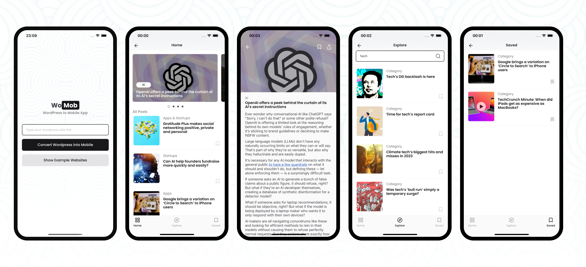

# WoMob - WordPress to Mobile App

This app utilizes the WordPress REST API. After clicking the convert button, your WordPress website will be transformed into a mobile app. Currently, there is only a blog template available.

## Intro Videos
- Demo video shows you what the app can do in simple terms. [Demo Video](https://www.youtube.com/watch?v=1vto0uXtHTQ)

## Tech Stack
| Library           | Version |
| ----------------- | ------- |
| React Native      | v0.74.1   |
| React             | v18.2.0     |
| TypeScript        | v5.3.3      | 
| React Navigation  | v6      |
| MobX-State-Tree   | v5.4      |
| MobX-React-Lite   | v4      |
| Expo              | v51     |
| RN Reanimated     | v3.1      |
| Jest              | v29.7     |
| React Native Testing Library | v12.5 |