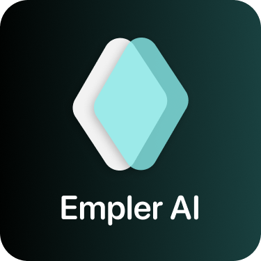

<p align="center"></p>

# WoMob - WordPress to Mobile App
[](https://wakatime.com/badge/github/burhanyilmaz/womob)

📱 Transform Your Website into a Mobile App with WoMob! 🚀

🔧 <b>Utilize the WordPress REST API:</b> Smoothly integrate your WordPress website into a mobile app environment.

🔄  <b>Easy Conversion Process:</b> With just a click of a button, your WordPress site converts into a functional mobile application.

📝  <b>Blog Template Available:</b> Start with a  simple blog template to showcase your content on mobile devices.

🌐  <b>Native Components:</b> All components are native without iframe content. Some post content includes an iframe element. App using web view for displaying part of this content.

💬  <b>Get Started Today:</b> Simply add your WordPress website URL and gain access to your personalized mobile app. It's that easy!

🙌  <b>Join the WoMob Community:</b> Join us in shaping the future of WoMob. Your input matters, and together, we can create something truly exceptional.


## Intro Videos
- Demo video shows you what the app can do in simple terms. [Demo Video](https://www.youtube.com/watch?v=1vto0uXtHTQ)
- See more details on womob product hunt page. [Product Hunt](https://www.producthunt.com/posts/womob)

## Quick Start
```
git clone https://github.com/burhanyilmaz/womob

yarn install || npm install

yarn android || yarn ios

// tests
yarn test

If you have questions, please feel free to ask.
```
<br/>

## Tech Stack
| Library           | Version |
| ----------------- | ------- |
| React Native      | v0.74.1   |
| React             | v18.2.0     |
| TypeScript        | v5.3.3      | 
| React Navigation  | v6      |
| MobX-State-Tree   | v5.4      |
| MobX-React-Lite   | v4      |
| Expo              | v51     |
| Nativewind          | v2    |
| RN Reanimated     | v3.1      |
| Jest              | v29.7     |
| React Native Testing Library | v12.5 |

## Sponsors
<a style="align:center" href="https://empler.ai/"></a>
